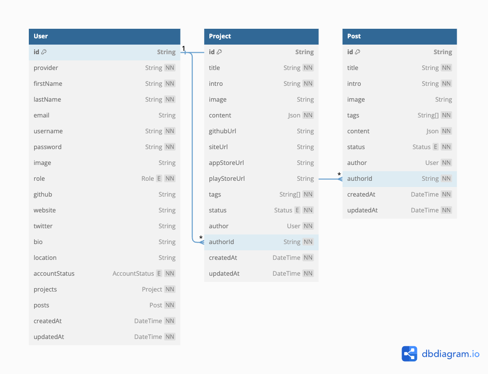

# pulse

> Pulse is a platform for developers to share their knowledge by creating projects + blog posts and connect with other developers. Built to learn and practice Terraform, monorepo management and AWS.

This repository is managed as a monorepo. It uses PNPM & PNPM workspaces to do this

### Applications

| Application                                                                                                               |
| ------------------------------------------------------------------------------------------------------------------------  |
| **[Admin](apps/admin/README.md)** <br /> Admin: Next.js app for admin users to manage the service |
| **[Common](apps/common/README.md)** <br /> Common: Provides common functionality that the admin and frontend apps consume |
| **[Frontend](apps/frontend/README.md)** <br /> Frontend: Next.js app that provides public access to Pulse                 |
| **[Server](apps/server/README.md)** <br /> Server: Node.js backend GraphQL API that serves admin and frontend                  |


### Packages 
| Package                                                                                 | Internal package |
| --------------------------------------------------------------------------------------- | ------------------------ |
| [Editor](packages/editor/README.md) <br /> Provides @editorjs wysiwyg editor consumed by admin and frontend | Yes                      |
| [Graphql-hooks](packages/graphql-hooks/README.md) <br /> GraphQL code generator  consumed by admin and frontend        | Yes                      |
| [UI](packages/ui/README.md) <br /> UI                                   | Yes      

### Infrastructure
TBA

## Documentation 

View the individual README files in `/apps/*` and `packages/*` for further developer information


## Environments
TBA

## Contributing

Contributions are welcome! Please see [CONTRIBUTING.md](CONTRIBUTING.md) for more info

### Getting Started

Make sure you're using the correct version of Node. The easiest way to do this is to use [NVM](https://github.com/nvm-sh/nvm).


```sh
nvm use
```

Then install the dependencies using PNPM

```sh
pnpm i
```

Each application will have instructions on how to run it in its own README file

## Roadmap
See roadmap [here](./roadmap.md)


## DB schema



## License
MIT
